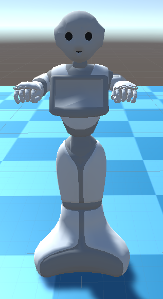
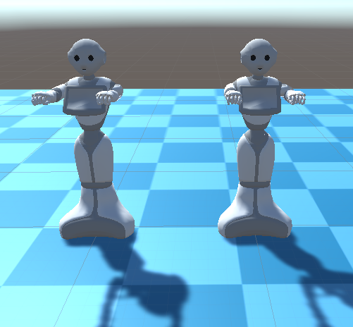
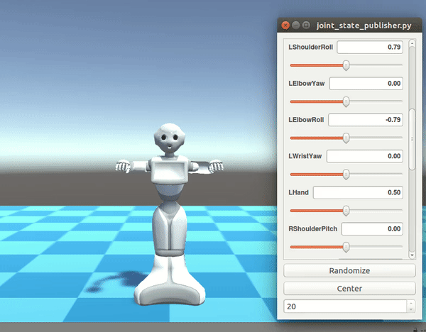

## Learning Engagement

### TODO list
* Setup Unity simulation environment with Pepper & demonstrator
* Communication between Unity and ROS (possibly) for Pepper and demonstrator
* Training workflow between Unity and algorithms
* User study interface design (response collections at front-back end)
* Learning engagement design & rationals

### Simulation platform
### [ROS#](https://github.com/siemens/ros-sharp)

ROS# is a set of open source software libraries and tools in C# for communicating with ROS from .NET applications, in particular Unity.

### Pepper robot



Control pepper in Unity (panel demo):




### Setups & Installation

#### Unity (version >= 2018.2.6)
1. Copy [RosSharp](https://github.com/mingfeisun/ros-sharp/tree/master/Unity3D/Assets/RosSharp) into the Assets folder of Unity project 
2. In the Unity menu, go to *Edit* > *Project Settings* > *Player*
3. In the inspector panel, look under *Settings* > *Configuration*, set *Scripting Runtime Version* to *.Net 4.x Equivalent*

More details can be found [here](https://github.com/siemens/ros-sharp/wiki/User_Inst_Unity3DOnWindows)

#### ROS (version Kinetic)
1. Copy [ROS packages](https://github.com/mingfeisun/ros-sharp/tree/master/ROS) to *src* folder
2. Building: 
``` bash 
# generate build/ and devel/
catkin_make 
# source env
source devel/setup.bash
# running
```

#### Installation step by step
1. Download Unity3D from [here](https://beta.unity3d.com/download/dad990bf2728/public_download.html)
2. Install ros-kinetic-rosbridge-server
``` bash
sudo apt-get install ros-kinetic-rosbridge-server
```
3. Create workstation: catkin_ws/src
4. Download [*file_server*](https://github.com/mingfeisun/ros-sharp/tree/master/ROS/file_server), [*gazebo_simulation_scene*](https://github.com/mingfeisun/ros-sharp/tree/master/ROS/gazebo_simulation_scene) and [*unity_simulation_scene*](https://github.com/mingfeisun/ros-sharp/tree/master/ROS/unity_simulation_scene) pkgs, and place them to src/ folder
5. In catkin_ws/ folder, build project: *catkin_make*
